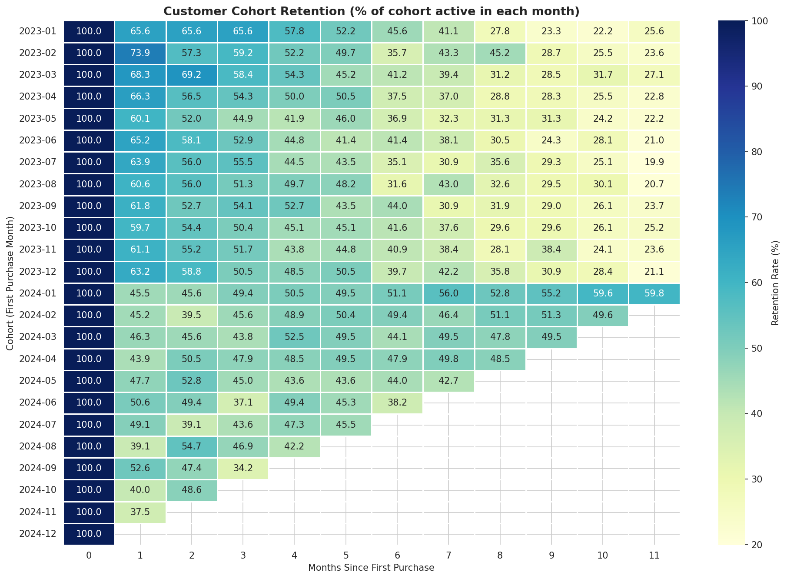
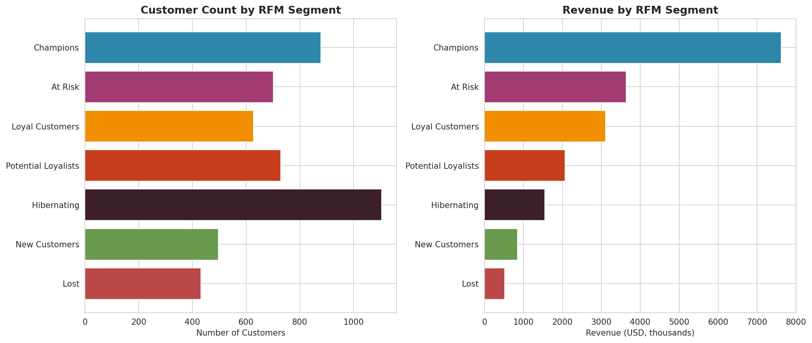
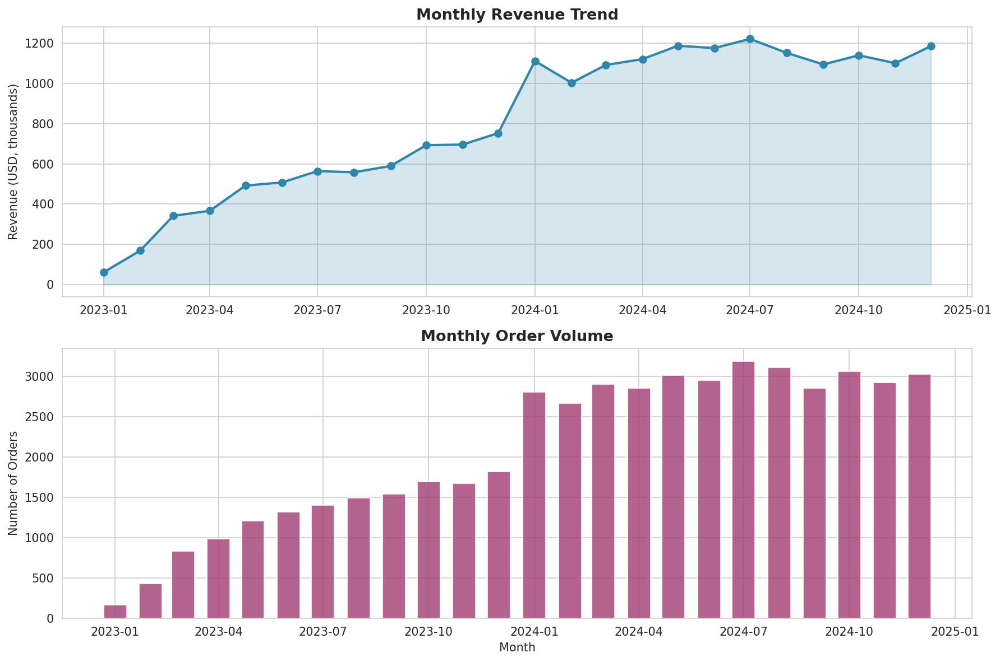

# E-commerce Customer Analytics

End-to-end customer analytics project on a 50,000-transaction e-commerce dataset. Identifies high-value customer segments, measures retention, and translates the findings into prioritized business actions.


---

## Project Overview

This project answers a real question that data analysts get every week:

> *"We have transaction data. Who are our most valuable customers, are we retaining them, and what should we do about it?"*

The deliverables are:

- **Reproducible analytics pipeline** (Python modules under `src/`)
- **Executive report** with charts and recommendations (`reports/`)
- **Walk-through notebook** for stakeholders and reviewers (`notebooks/`)

Synthetic data is generated locally so anyone can clone the repo and reproduce every number end-to-end.

---

## Key Findings

| # | Insight | Implication |
| - | ------- | ----------- |
| 1 | The top 20% of customers generate ~70% of revenue | Retention is the highest-leverage investment |
| 2 | Month-1 retention is 55%, dropping to ~26% by month 12 | The onboarding flow is the biggest churn lever |
| 3 | *Champions* are 18% of customers but 39% of revenue | A formal VIP program is justified |
| 4 | *At Risk* + *Cannot Lose Them* hold ~19% of historical revenue | Immediate win-back campaign required |
| 5 | Mobile App AOV matches Web ($391 vs $385) | Treat mobile as a first-class commerce surface |

A full set of recommendations with priority, expected impact, and time horizon is in [`reports/executive_report.md`](reports/executive_report.md).

---

## Visual Highlights

### Cohort Retention


### RFM Segmentation


### Revenue & Seasonality


---

## Methodology

### 1. RFM Segmentation
Customers are scored 1–5 on **Recency** (days since last purchase), **Frequency** (number of orders), and **Monetary** (total spend). The combined scores map to actionable segments — *Champions*, *Loyal*, *At Risk*, *Hibernating*, etc. — each with a specific marketing recommendation.

### 2. Cohort Retention Analysis
Customers are grouped by their first-purchase month, then tracked monthly to measure what share remains active. The output is a retention heatmap that surfaces month-over-month drop-off and lets us compare cohort quality over time.

### 3. CLV (Historical)
Lifetime value is computed from observed spend per customer. The distribution exposes the Pareto pattern (revenue concentration in the top quintile) and serves as the baseline for a future predictive CLV model (BG/NBD + Gamma-Gamma is the natural next step).

### 4. KPI Reporting
Standard e-commerce metrics — Revenue, Orders, AOV, Repeat Purchase Rate, Category and Channel Performance — refreshable from the same source dataset.

---

## Project Structure

```
ecommerce-customer-analytics/
├── data/                          # Generated CSV datasets
│   ├── customers.csv              # 5,000 customer records
│   ├── products.csv               # 200 product catalog
│   └── transactions.csv           # 50,000 transactions
│
├── notebooks/
│   └── 01_main_analysis.ipynb     # End-to-end walkthrough
│
├── src/                           # Reusable analytics modules
│   ├── generate_data.py           # Synthetic dataset generator
│   ├── kpi_metrics.py             # Revenue, AOV, channel, category KPIs
│   ├── rfm_analysis.py            # RFM scoring and segmentation
│   ├── cohort_analysis.py         # Retention cohort tables
│   └── visualizations.py          # Chart generation
│
├── reports/
│   └── executive_report.md        # Stakeholder-ready summary
│
├── images/                        # Generated visualizations
│
├── requirements.txt
├── .gitignore
└── README.md
```

---

## Getting Started

### Prerequisites
- Python 3.10 or higher
- pip

### Installation

```bash
# Clone the repository
git clone https://github.com/<your-username>/ecommerce-customer-analytics.git
cd ecommerce-customer-analytics

# (Recommended) Create a virtual environment
python -m venv venv
source venv/bin/activate          # On Windows: venv\Scripts\activate

# Install dependencies
pip install -r requirements.txt
```

### Reproduce the Analysis

```bash
# 1. Generate the synthetic dataset
python src/generate_data.py

# 2. Run individual modules to inspect intermediate output
python src/kpi_metrics.py
python src/rfm_analysis.py
python src/cohort_analysis.py

# 3. Generate all charts
python src/visualizations.py

# 4. Open the notebook for the full walkthrough
jupyter notebook notebooks/01_main_analysis.ipynb
```

---

## Tech Stack

| Layer | Tools |
| ----- | ----- |
| Language | Python 3.10+ |
| Data manipulation | pandas, numpy |
| Visualization | matplotlib, seaborn |
| Notebook | Jupyter |
| Statistical helpers | scikit-learn (for downstream modeling) |

---

## Roadmap

- [ ] Predictive CLV model using `lifetimes` (BG/NBD + Gamma-Gamma)
- [ ] Churn prediction with gradient boosting on RFM + behavioral features
- [ ] Streamlit dashboard for interactive exploration
- [ ] Market basket analysis on transaction-level product co-purchases
- [ ] Geographic revenue breakdown and country-level cohort tables

---

## About the Author

Data Analyst with experience in customer analytics, retention modeling, and turning ambiguous business questions into prioritized, measurable actions.

- LinkedIn: [your-linkedin-url]
- Portfolio: [your-portfolio-url]
- Email: your.email@example.com

---

## License

This project is licensed under the MIT License — see the [LICENSE](LICENSE) file for details.

> **Note on data:** All data in this repository is synthetic and generated programmatically by `src/generate_data.py`. It is designed to mimic realistic e-commerce patterns (seasonality, customer segments, product mix) but does not represent any real company or individual.
