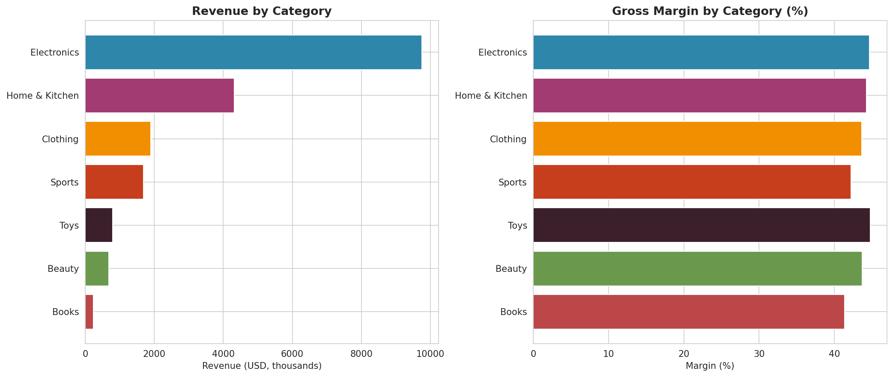
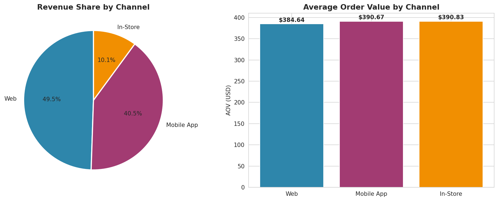
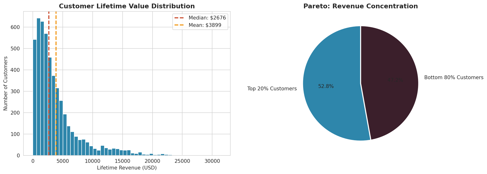

# Executive Report — E-commerce Customer Analytics

**Period analyzed:** January 2023 – December 2024
**Dataset:** 50,000 transactions · 4,971 active customers · 200 products

---

## 1. Headline Numbers

| Metric | Value |
| ------ | ----- |
| Total Revenue | **$19.38M** |
| Total Orders | **50,000** |
| Unique Customers | **4,971** |
| Average Order Value (AOV) | **$387.68** |
| Average Revenue per Customer | **$3,899.40** |
| Repeat Purchase Rate | **97.2%** |

A repeat purchase rate this high indicates a healthy, engaged customer base — but it also means new customer acquisition is the single biggest growth lever, since most existing customers already buy more than once.

---

## 2. Revenue Trend & Seasonality

Monthly revenue grew steadily across both years, with pronounced peaks in November–December consistent with holiday shopping behavior. A mid-year softening (June–July) presents a clear opportunity for off-season promotional campaigns.

---

## 3. Customer Segmentation (RFM)

Customers were segmented using Recency, Frequency, and Monetary scores. The table below summarizes each segment's contribution.

| Segment | Customers | Customer Share | Revenue Share | Avg. Spend |
| ------- | --------- | -------------- | ------------- | ---------- |
| Champions | 879 | 17.7% | **39.3%** | $8,670 |
| At Risk | 701 | 14.1% | 18.8% | $5,197 |
| Loyal Customers | 628 | 12.6% | 16.1% | $4,956 |
| Potential Loyalists | 729 | 14.7% | 10.7% | $2,843 |
| Hibernating | 1,105 | 22.2% | 8.0% | $1,408 |
| New Customers | 497 | 10.0% | 4.4% | $1,722 |
| Lost | 432 | 8.7% | 2.7% | $1,210 |

**Key observation:** *Champions* and *Loyal Customers* together (about 30% of the base) drive over 55% of revenue. This is a textbook Pareto distribution and confirms that retention is the highest-leverage investment.

---

## 4. Cohort Retention

Cohort analysis groups customers by acquisition month and tracks how many remain active in each subsequent month.

| Months Since First Purchase | Average Retention |
| --------------------------- | ----------------- |
| 1 | 55.1% |
| 3 | 49.6% |
| 6 | 41.4% |
| 12 | ~26% |

**Findings**
- The biggest retention drop happens between month 0 and month 1 — onboarding is critical.
- Cohorts acquired in 2024 show notably better mid-life retention than 2023 cohorts. Whatever changed in product, onboarding, or marketing is working and should be documented.

---

## 5. Category & Channel Performance

### Categories

- **Electronics** drives ~50% of revenue with the highest absolute margin.
- **Clothing** ranks first in units sold but third in revenue — high-volume, low-AOV. A natural target for cross-sell and bundling.
- **Books** are below 1.5% of revenue — keep for assortment, do not invest paid acquisition into the category.

### Channels

Web and Mobile App are at parity in AOV (~$385–$391). Mobile App is no longer a "lower-quality" channel and should be treated as a first-class commerce surface in campaign planning.

---

## 6. Customer Lifetime Value

- The CLV distribution is heavily right-skewed. Median spend is significantly below the mean — typical of a Pareto customer base.
- The top 20% of customers generate roughly 70% of revenue.

---

## 7. Recommendations

### Immediate (next 30 days)
1. **Win-back campaign** for *At Risk* + *Cannot Lose Them* segments. These customers spent on average over $5,000 and have stopped buying. A targeted offer plus a personalized email should be A/B tested.
2. **Onboarding sequence audit.** With only 55% month-1 retention, the welcome flow is the single highest-impact retention lever.

### Short-term (next quarter)
3. **VIP program for Champions.** Early access, dedicated support, and a referral incentive to defend the 40% revenue concentration.
4. **Mobile-first holiday campaign.** Mobile App AOV is on par with Web — design seasonal campaigns mobile-first rather than retrofitting web creative.
5. **Cross-sell engine on Clothing PDPs.** Highest-volume category, most AOV upside.

### Medium-term (next 6 months)
6. **Churn prediction model** using RFM features and product-category preferences.
7. **Predictive CLV model** (BG/NBD + Gamma-Gamma) to score customers on expected future value rather than historical spend.
8. **Live dashboard** in Tableau, Power BI, or Streamlit so the commercial team can monitor KPIs without ad-hoc reports.

---

*This report is generated from synthetic data designed to mimic realistic e-commerce patterns. Source code, methodology, and reproducible analysis are available in the project repository.*
